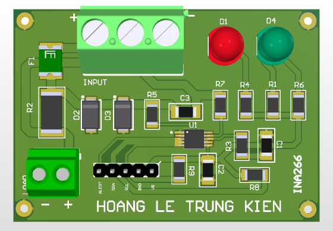

# INA226 High-Side Power Monitor

Digital power measurement module.

## Function
Measures voltage, current, and power via I2C.

## Key Specifications
- IC: INA226
- Interface: I2C
- Sensing: High-side with shunt
- Filter: RC input filter

## Hardware Preview

---
Designed by HOANG LE TRUNG KIEN
